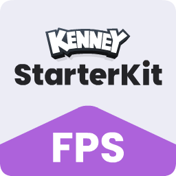

# Starter Kit FPS (Campaign + LAN Edition)

This project now includes a playable home screen flow with both campaign and local/LAN multiplayer paths.

- Home menu UI with mode selection
- Campaign with 3 levels and progression
- Local/LAN multiplayer host + connect flow
- Host settings: password and max players
- URL/IP-based join flow (LAN or online reachable host)

### Main Flow

1. Launch game -> **Home UI**
2. Click **Play Campaign** to start campaign levels
3. Or click **Local Multiplayer** to host or connect to a lobby

### Local Multiplayer

Host options:
- Port
- Max players
- Optional password

Join options:
- Host URL/IP (e.g. `192.168.1.20`)
- Port
- Password (if host configured one)
# Starter Kit FPS (Campaign + Team Multiplayer Edition)

This fork now includes a complete home flow, multi-level campaign, and local/online multiplayer with teams.

## What's Added

- Home menu UI with mode selection
- Separate multiplayer pages for:
  - **Host Server**
  - **Connect to Server**
- Team mode in multiplayer:
  - **SHELLSHOCKERS** vs **RUSHTEAM**
- Large generated war-city map for multiplayer (ramps, walls, buildings)
- Expanded campaign with 3 levels and progression objectives
- Expanded loadout:
  - Slot 1: Blaster
  - Slot 2: Repeater
  - Slot 3: RPG
  - Slot 4: Grenade Launcher
  - Slot 5: Medkit heal

## Multiplayer Hosting + Online Play

You can host on LAN or online:

| Key | Command |
| --- | --- |
| <kbd>W</kbd> <kbd>A</kbd> <kbd>S</kbd> <kbd>D</kbd> | Movement |
| <kbd>Spacebar</kbd> | Jump |
| <kbd>Left mouse button</kbd> | Shoot (campaign player) |
| <kbd>E</kbd> | Switch weapon (campaign player) |
| <kbd>Esc</kbd> | Release mouse |

### License

MIT License

Copyright (c) 2026 Kenney

Permission is hereby granted, free of charge, to any person obtaining a copy
of this software and associated documentation files (the "Software"), to deal
in the Software without restriction, including without limitation the rights
to use, copy, modify, merge, publish, distribute, sublicense, and/or sell
copies of the Software, and to permit persons to whom the Software is
furnished to do so, subject to the following conditions:

The above copyright notice and this permission notice shall be included in all
copies or substantial portions of the Software.

THE SOFTWARE IS PROVIDED "AS IS", WITHOUT WARRANTY OF ANY KIND, EXPRESS OR
IMPLIED, INCLUDING BUT NOT LIMITED TO THE WARRANTIES OF MERCHANTABILITY,
FITNESS FOR A PARTICULAR PURPOSE AND NONINFRINGEMENT. IN NO EVENT SHALL THE
AUTHORS OR COPYRIGHT HOLDERS BE LIABLE FOR ANY CLAIM, DAMAGES OR OTHER
LIABILITY, WHETHER IN AN ACTION OF CONTRACT, TORT OR OTHERWISE, ARISING FROM,
OUT OF OR IN CONNECTION WITH THE SOFTWARE OR THE USE OR OTHER DEALINGS IN THE
SOFTWARE.
1. Host a server (choose port, max players, optional password).
2. If playing online, expose/forward your UDP port on your router/firewall.
3. Share your public IP or domain + port with players.
4. Players connect using the **Connect to Server** page.

## Controls

| Key | Command |
| --- | --- |
| `W A S D` | Movement |
| `Space` | Jump |
| `Left Mouse` | Shoot |
| `E` | Next weapon |
| `1` `2` `3` `4` | Direct weapon slots |
| `5` | Use medkit (heal) |
| `Esc` | Release mouse |

## License

MIT License, original assets by Kenney (CC0 where applicable).
